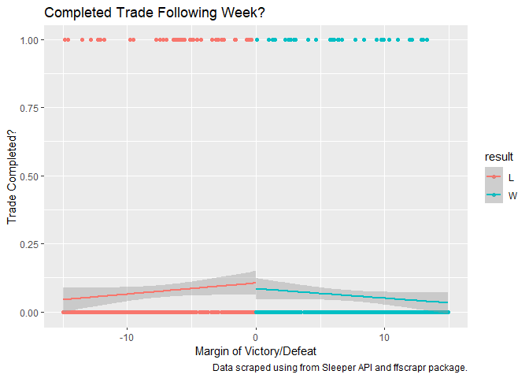
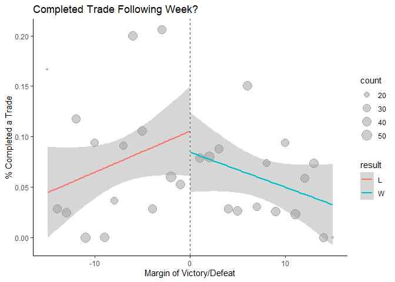

# Fantasy Football Trade Behavior

### Motivation

Why do players make trades in fantasy football? A prominent literature
in behavioral economics called Prospect Theory argues that people are
more sensitive to losses compared to relatively similar gains. Applying
this behavioral economic insight to fantasy football, I argue that
players are more likely to conduct trades after close losses relative to
close wins.

### Data

Data is scraped from Sleeper, a popular fantasy football platform, for a
sample of 42 leagues in 2022. The script `etl_sample_data.R` extracts
the data from Sleeper, transforms it into a series of clean data sets,
and loads it into clean CSV files including data on schedules
`schedule_dat.csv`, teams in each league `teams_dat.csv`, league summaries `summary_dat.csv`, and transactions
(including trades, but also waiver claims) `transactions_dat.csv`.

### Analysis of Sample Data

To understand the relative impact of close losses on trade behavior
compared to close wins, I use a regression discontinuity design to
leverage the as-if random assignment of result status (win/loss) on
whether a player completes a trade on the following week. I reduce my
analysis to just games during the first 8 weeks of season as leagues may
have trade deadlines that after week 8, which would prevent trades from occurring and thus adding noise to the analysis. Analysis can be found in `analysis_rdd_sample_data.R`.

First, the plots below suggest that a relationship may exist, but that
some caution should be used when moving to the regression analysis. In
the plot below, each point represents an outcome that was decided by
less than 15 points. The y-axis takes the value of 0 if a player did not
complete a trade during the following week and takes a value of 1 if so.
The relationship between close wins and losses is not immediately
obvious.

<!-- -->

The plot below instead bins outcomes outcomes to the nearest whole
point. Now points along the y-axis are the proportion of outcomes in
that bin that completed a trade during the following week. The results
are more clear than in the previous plot and suggest that a small
difference between close winners and losers may exist, with close losers
trading about 2pp more than close winners. But this should be
interpreted with caution as the standard errors are fairly large and the
difference does not appear to be statistically insignificant.

<!-- -->

I next move to the regression analysis. I use the `rdrobust` package to
determine the optimal bandwidth, which comes out to be 69.38. I then
calculate the kernel weights as proportional to the cutoff vis-a-vis the
bandwidth. For the regression, I control for the team’s total number of
points scored, as higher scoring teams may be less likely to trade. I
also include league and week number fixed effects to account for any
idiosyncratic differences across different leagues (such as any personal
relationships that may exist) and differences in trade behavior that may
exist week to week. Finally, I cluster standard errors by team to
account for team specific trade behavior. I estimate the following
equation for team $i$, league $L$, and week $w$:

$T_{w+1,i} = \beta_0 + \beta_1*Margin_{w,i} + \beta_2*Win_{w,i} + \beta_3*(Margin*Win)_{w,i} + \beta_4*Score_{w,i} + \gamma_L + \alpha_w$

I get the following results:

    ## 
    ## Call:
    ##    felm(formula = trade_indicator ~ points_margin + I(points_margin >      0) + I(points_margin > 0) * points_margin + franchise_score |      league_id + week | 0 | franchise_id, data = subset(dat_reg,      dat_reg$kw > 0), weights = subset(dat_reg, dat_reg$kw > 0)$kw) 
    ## 
    ## Weighted Residuals:
    ##      Min       1Q   Median       3Q      Max 
    ## -0.38821 -0.06800 -0.03462 -0.00685  0.97605 
    ## 
    ## Coefficients:
    ##                                          Estimate Cluster s.e. t value Pr(>|t|)
    ## points_margin                          -0.0000592    0.0004370  -0.135    0.892
    ## I(points_margin > 0)TRUE               -0.0180221    0.0118933  -1.515    0.130
    ## franchise_score                         0.0001051    0.0002390   0.440    0.660
    ## points_margin:I(points_margin > 0)TRUE  0.0003768    0.0007864   0.479    0.632
    ## 
    ## Residual standard error: 0.1973 on 3607 degrees of freedom
    ## Multiple R-squared(full model): 0.08591   Adjusted R-squared: 0.07273 
    ## Multiple R-squared(proj model): 0.0007711   Adjusted R-squared: -0.01363 
    ## F-statistic(full model, *iid*):6.519 on 52 and 3607 DF, p-value: < 2.2e-16 
    ## F-statistic(proj model): 0.6176 on 4 and 31 DF, p-value: 0.6533

As the descriptive analysis suggested, we cannot reject the null
hypothesis that close winners and losers trade at different rates during
the following week. But the p-value is 0.13 and is almost statistically
significant at conventional levels. Furthermore, given that players
trade 7.47 percent of the time, an increase in trade activity by 1.8pp
is fairly large.

### Conclusion

Further data will need to gathered before we can be confident with the
results. Next steps will include scraping additional data. Additional
analysis to understand the *quality* of trades will also be an important
next step. If my theory is correct, then not only could it suggest that
people are more sensitive to relative losses (in line with existing
literature), but also that they make worse decisions as a result.

### Questions or Comments?

If you have any questions or comments, please feel free to reach out to
me at <krosind@gmail.com>.
