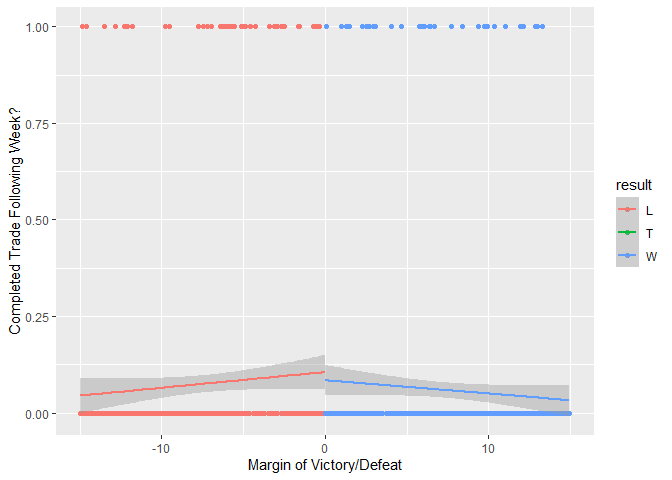

# Fantasy Football Trade Behavior

### Motivation

Why do players make trades in fantasy football? A prominent literature
in behavioral economics called Prospect Theory argues that people are
more sensitive to losses compared to relatively similar gains. Applying
this behavioral economic insight to fantasy football, I argue that
players are more likely to conduct trades after close losses relative to
close wins.

### Data

Data is scraped from Sleeper, a popular fantasy football platform, for a
sample of leagues. The script `etl_sample_data.R` extracts the data from
Sleeper, transforms it into a series of clean data sets, and loads it
into clean CSV files.

### Analysis

``` r
dat_reg %>%
  filter(abs(points_margin) < 15) %>%
  ggplot(aes(points_margin,trade_indicator,color = result)) +
  geom_point() +
  geom_smooth(formula = y ~ x,method="lm") +
  xlab("Margin of Victory/Defeat") + ylab("Completed Trade Following Week?")
```

<!-- -->
